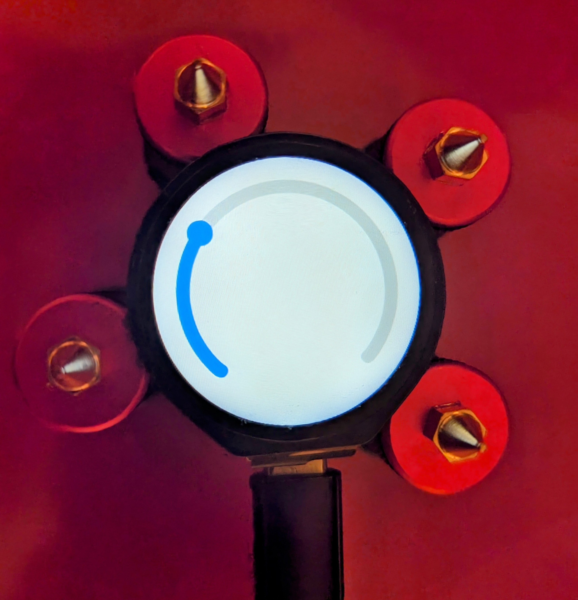

# ESP32-S3-TOUCH-LCD-1.28



Rust boilerplate to support [ESP32-S3-Touch-LCD-1.28](https://www.waveshare.com/wiki/ESP32-S3-Touch-LCD-1.28) from WaveShare.

## Features

* Crate [`lvgl`](https://github.com/lvgl/lv_binding_rust)
* Crate [`shared-bus`](https://github.com/Rahix/shared-bus)
* Driver [`qmi8658`](https://github.com/IniterWorker/qmi8658) _accelerometer,pedometer,gyroscope_
* Driver [`cst816s`](https://github.com/IniterWorker/cst816s) _touch screen_

## Getting Started

```bash
espup install --extended-llvm
# edit /home/${USER}/export-esp.sh
# Add export C_INCLUDE_PATH="/home/${USER}/.rustup/toolchains/esp/xtensa-esp-elf/esp-13.2.0_20230928/xtensa-esp-elf/xtensa-esp-elf/include"
. /home/${USER}/export-esp.sh
cargo build --release
```


## License

Licensed under either of

- Apache License, Version 2.0 ([LICENSE-APACHE](LICENSE-APACHE) or
  http://www.apache.org/licenses/LICENSE-2.0)
- MIT license ([LICENSE-MIT](LICENSE-MIT) or http://opensource.org/licenses/MIT)

at your option.

### Contribution

Unless you explicitly state otherwise, any contribution intentionally submitted for inclusion in the
work by you, as defined in the Apache-2.0 license, shall be dual licensed as above, without any
additional terms or conditions.
